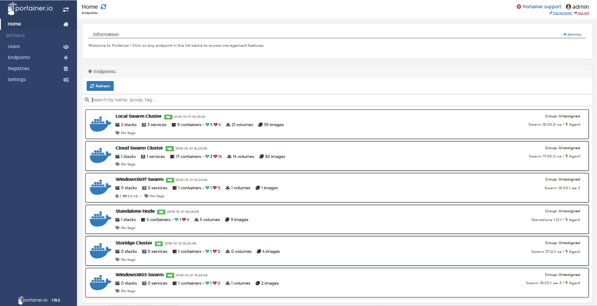

# Portainer

Portainer Community Edition (Portainer CE) is a lightweight management toolset that allows you to easily build, manage and maintain Docker environments

## Prerequisites

Having completed lab **00 - Setup lab environment**

## Connect to Sunnyvale's Ubuntu VM

```console
$ cd <GIT_REPO_NAME>/vagrant
$ vagrant up
$ vagrant ssh
vagrant@docker-vm:~$ 
```

## Install Portainer

```console
vagrant@docker-vm:~$ docker volume create portainer_data
portainer_data
``` 


```console
vagrant@docker-vm:~$ docker run \
    -d \
    -p 8000:8000 \
    -p 9000:9000 \
    -v /var/run/docker.sock:/var/run/docker.sock \
    -v portainer_data:/data \
    portainer/portainer
d8f7afd1a68452bbece3eacd788a387094d174ce4cde6ad529b4e0371909453e
``` 

## Access to Portainer

If you point your browser to http://192.168.135.10:9000 you should see a screen asking you to create an initial password. Having done this, your should enter into the Portainer Home Screen.

